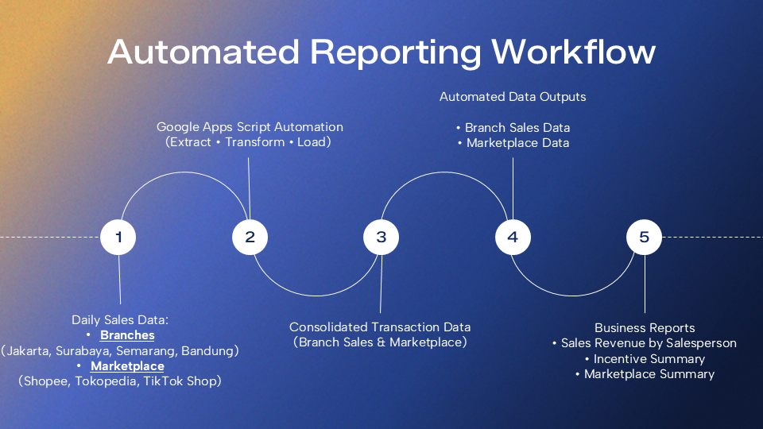
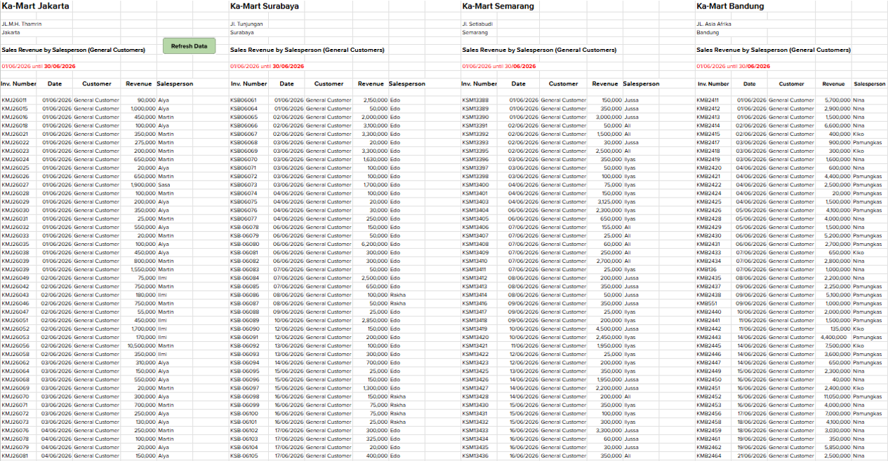
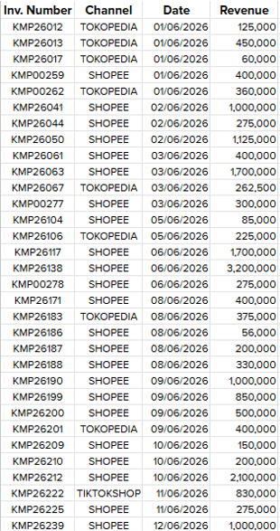
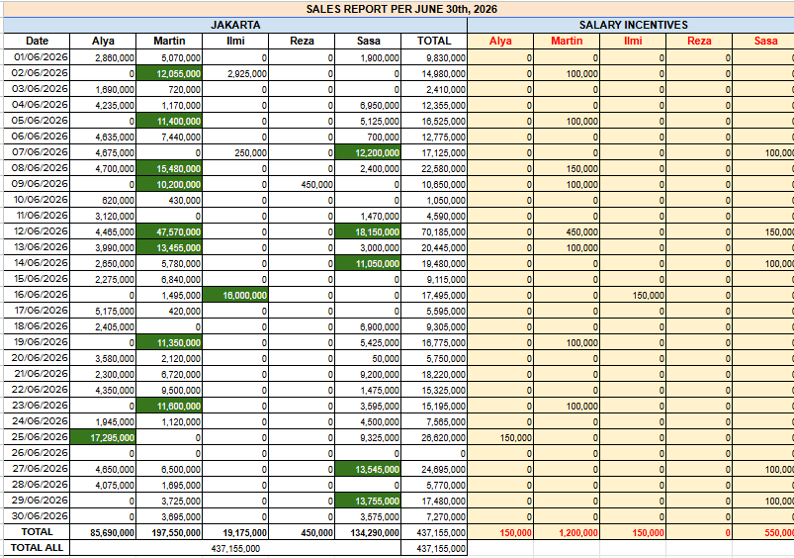
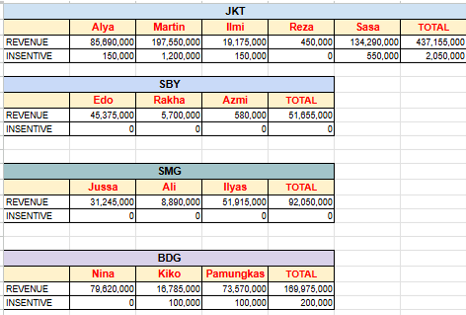
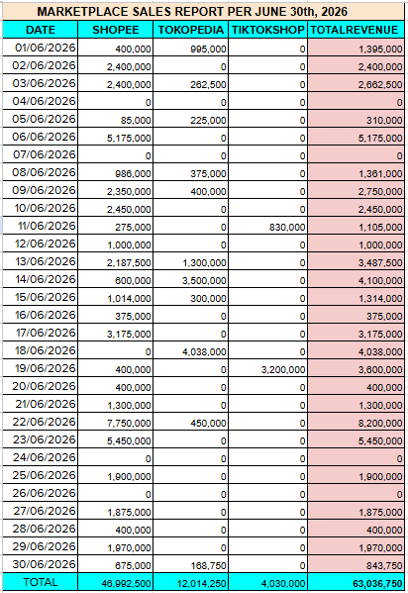

# 📊 Sales Reporting Automation using Google Apps Script


Automated sales reporting solution built with **Google Apps Script** to consolidate daily transaction data from multiple branch spreadsheets into centralized reporting datasets.

The automation eliminates repetitive manual consolidation and provides standardized datasets used for daily operational monitoring, salesperson incentive calculations, and marketplace performance reporting.

> **⚠️ Disclaimer**
>
> This repository contains an anonymized version of the original project.
>
> All spreadsheet IDs, branch names, employee names, customer information, invoice numbers, and business-sensitive data have been replaced with dummy values for portfolio purposes.

---

# 📌 Project Overview

Managing sales data from multiple branches can become repetitive and time-consuming when reports must be updated every day.

This project automates the process of extracting transaction data from multiple Google Sheets, transforming the data into a standardized format, and consolidating it into centralized reporting sheets.

The generated datasets are then used as the primary data source for business reports and salesperson incentive calculations.

---

# 🎯 Business Problem

The finance team required updated sales data every day for operational control and incentive calculations.

However, transaction data was distributed across multiple branch spreadsheets, resulting in several challenges:

- Manual copy-paste between spreadsheets
- Repetitive daily reporting activities
- Risk of human error
- Time-consuming consolidation process
- Delayed reporting for stakeholders

---

# 💡 Solution

Google Apps Script was implemented to automate the reporting workflow.

The automation performs the following tasks:

- Connects to multiple branch spreadsheets
- Reads daily sales transactions
- Filters transactions based on business rules
- Identifies marketplace transactions
- Standardizes transaction data
- Consolidates all records into centralized reporting sheets
- Updates reports automatically with a single execution

---

# ⚙️ Workflow



---

# 🛠 Technical Implementation

### Data Extraction

- Read transaction data from multiple branch spreadsheets
- Retrieve invoice number, transaction date, salesperson, payment method, and sales amount

### Data Transformation

- Convert sheet names into transaction dates
- Filter valid payment methods
- Filter marketplace transactions
- Standardize transaction structure
- Sort transactions chronologically

### Data Loading

Automatically generate:

- Branch Sales Data
- Marketplace Data

These datasets are then used as the source for downstream business reports.

---

# 📊 Outputs

## Branch Sales Data

Consolidated transaction records from all branches.



---

## Marketplace Data

Marketplace transaction dataset used for marketplace reporting.



---

## Daily Sales Performance & Incentive Report 

Automatically generated report displaying daily sales revenue for each salesperson by branch. The report enables stakeholders to monitor sales performance and serves as the basis for daily incentive calculations.



---

## Salesperson Incentive Summary

Daily sales aggregation used for incentive calculation.



---

## Marketplace Summary Report

Marketplace sales summary by sales channel.



---

# 🚀 Business Impact

The automation significantly improves reporting efficiency by:

- Reducing manual consolidation effort
- Improving reporting accuracy
- Standardizing transaction data
- Accelerating daily operational reporting
- Supporting salesperson incentive calculations
- Providing faster visibility for business monitoring

---

## 📂 Project Files

| File | Description |
|------|-------------|
| 📄 [View Project Presentation](docs/Sales%20Reporting%20Automation.pdf) | Project presentation and documentation |
| 📊 [Open Sample Google Sheets](https://docs.google.com/spreadsheets/d/1zCQPrO8UznqGPNLicScf3MfO6OOz2WQDpM20kEA3hIc/edit?usp=sharing) | Dummy workbook |

---

# 💻 Tech Stack

| Technology | Purpose |
|------------|---------|
| Google Apps Script | Automation |
| Google Sheets | Data Source & Reporting |
| JavaScript (ES6) | Scripting |
| SpreadsheetApp API | Spreadsheet Operations |
| Logger | Debugging |

---

# 📁 Repository Structure

```
sales-reporting-automation/
│
├── Code.gs
├── README.md
│
└── images/
    ├── workflow.png
    ├── branch-sales-data.png
    ├── sales-report-example.png
    ├── incentive-summary.png
    ├── marketplace-data.png
    └── marketplace-summary.png
```

---

# 📈 Key Features

✅ Multi-branch data consolidation

✅ Automated ETL process (Extract, Transform, Load)

✅ Marketplace transaction filtering

✅ Automated reporting datasets

✅ Salesperson incentive support

✅ Daily operational reporting

---

# 👩‍💻 Author

**Kurnia Wulandari**

This project was developed as part of my automation portfolio using Google Apps Script and Google Sheets.
